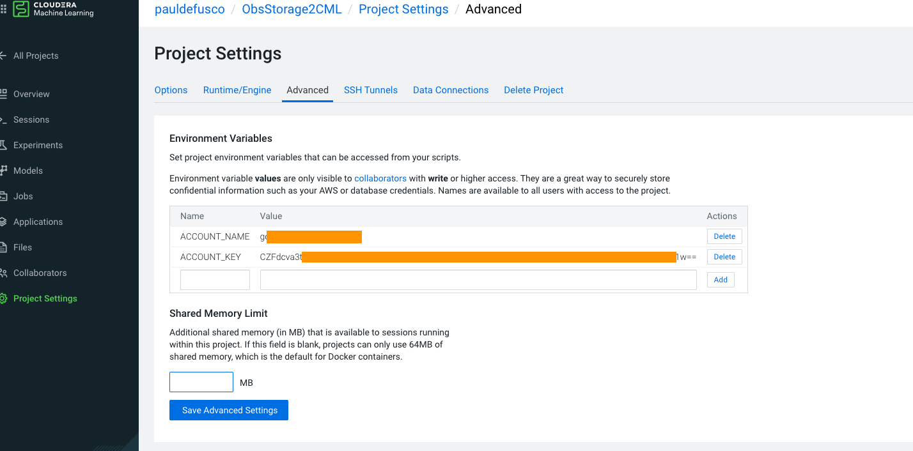
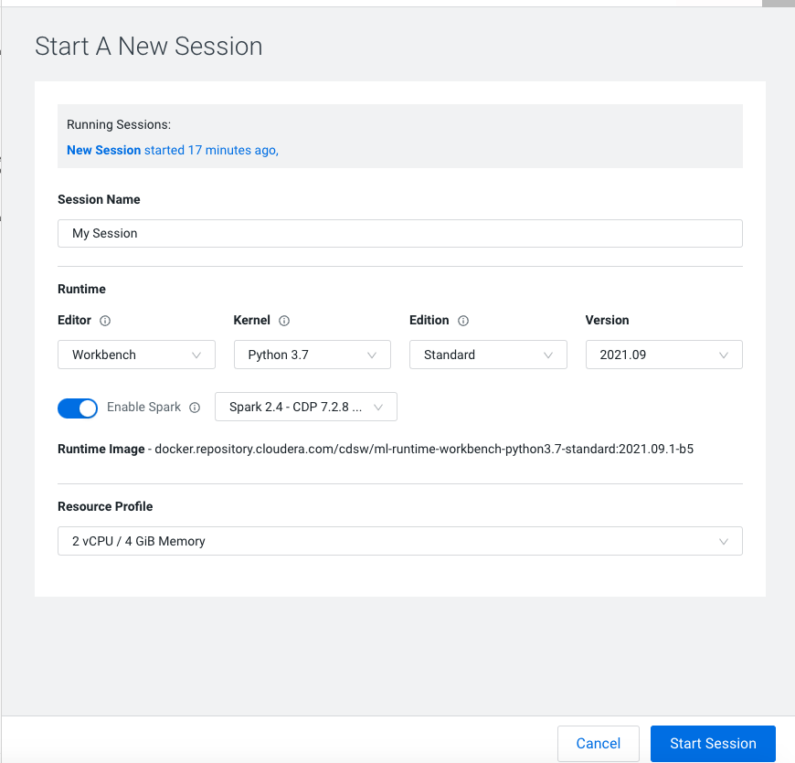
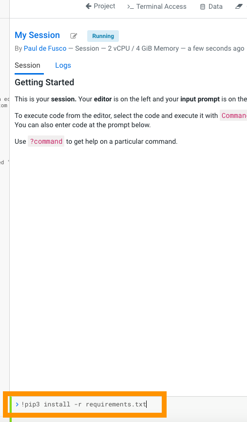
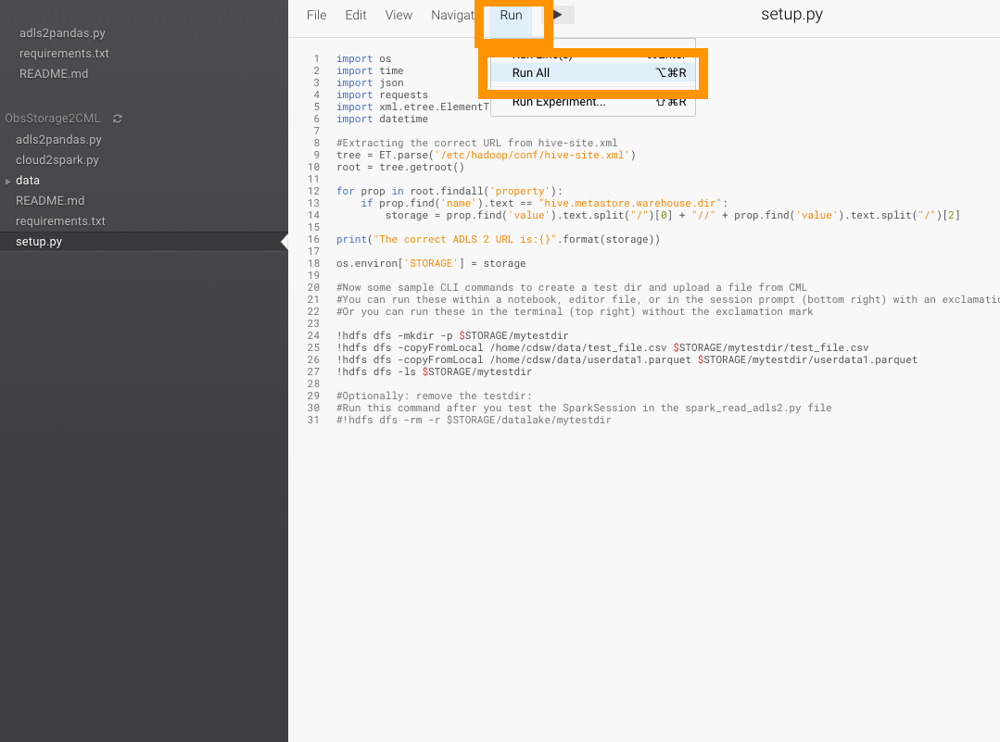
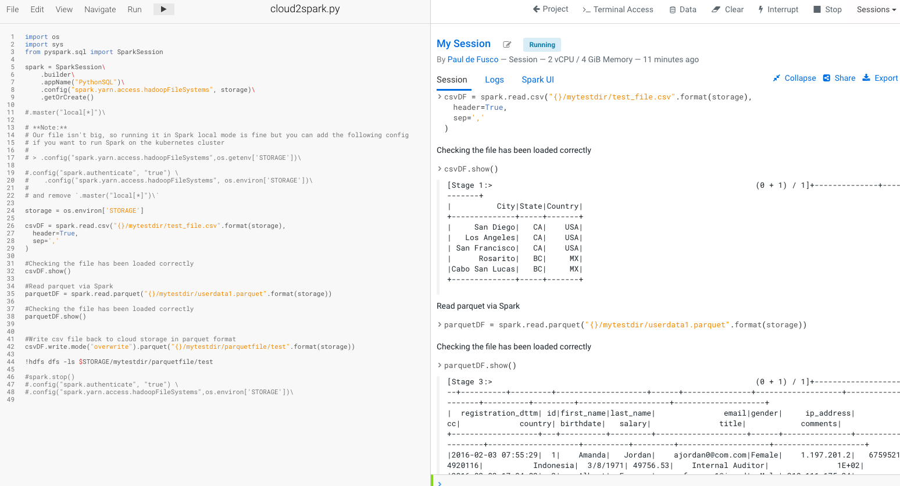
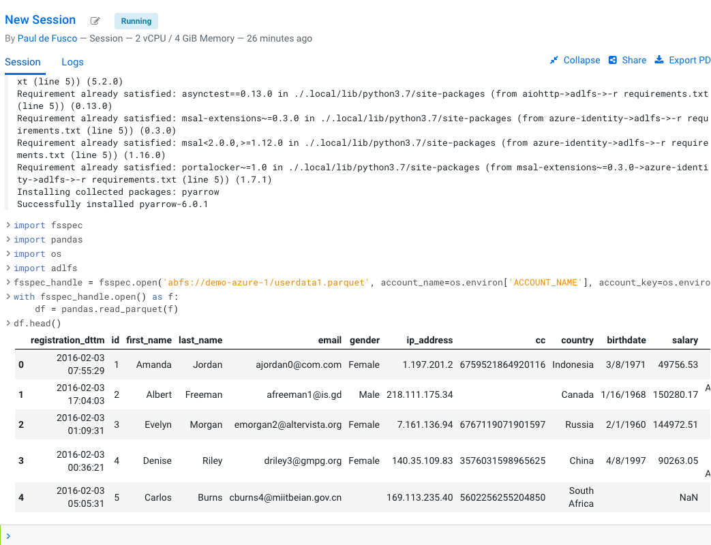

# Data Access Patterns

## Objective

This project provides an overview of available options for connecting to a variety of data sources from CML. 
Most of these options are applicable to CDSW. If unsure, please check with your Cloudera Account Team.

## Summary

Broadly speaking there are three categories of CML data access patterns. 

### Machine Learning Discovery and Exploration

In CML you can easily access CDW Virtual Warehouses via "Machine Learning Discovery and Exploration" aka "Data Connections". 

When you create a CML Session a pop up window will automatically present you with available connections. 

You can copy code from the pop up window and paste it into your session. No code modifications are required. 

This feature was introduced introduced in late 2021 and the Cloudera ML Engineering Team will be adding more.

If you want to learn more about CML Data Connections please visit [the documentation](https://docs.cloudera.com/machine-learning/cloud/mlde/topics/ml-mlde-intro.html) or this [how-to-article](https://community.cloudera.com/t5/Community-Articles/New-Feature-in-Cloudera-Machine-Learning-Data-Connections/ta-p/336775).

### Other Access Patterns

There are many options outside of the "Machine Learning Discovery and Exploration" feature.

This project provides you with an ever growing reference. 

If you have a request for a new Data Access pattern please don't hesitate to open a PR with this GitHub project.

* [Accessing Data with Spark](https://docs.cloudera.com/machine-learning/cloud/import-data/topics/ml-access-data-with-spark.html)
* [Accessing Data from your CML Project and Local Computer](https://docs.cloudera.com/machine-learning/cloud/import-data/topics/ml-accessing-local-data-from-your-computer.html)
* [Accessing Data from HDFS](https://docs.cloudera.com/machine-learning/cloud/import-data/topics/ml-accessing-data-from-hdfs.html)
* [Accessing Data from Hive](https://docs.cloudera.com/machine-learning/cloud/import-data/topics/ml-accessing-data-from-apache-hive.html) - Note: the "Machine Learning Discovery and Exploration" feature outlined above is recommended as a replacement to this option
* 

- The "cloud2spark.py" script works for both S3 or ADLS2 without making changes. 
- The "adls2pandas.py" script is designed to read from ADLS2 into Pandas without intermediate steps.

# Steb by Step Instructions 

0. Create ADLS Environment Variables

- Log into your Azure account and copy Access Key and Storage Account Name
- Navigate to Project Settings -> Advanced -> and add two environment variables as shown below

1. Install requirements: 

- Open a CML Session with Python 3.6+ and Spark Runtime enabled (2 or 3 makes no difference) and Workbench editor

- Run the "!pip3 install -r requirements.txt" command in the interactive Python prompt located at the bottom right or in the terminal (no need for the exclamation mark to prefix the command if running from terminal)

2. Execute "setup.py" (you can run this in a session with "Workbench" editor option)
    - This will get the correct url from hive-site.xml and save the ADLS URL to a temporary variable called "storage"
    - Then it will use the HDFS CLI to move data from the data folder into an ADLS container 
    

    
    
3. Execute "cloud2spark.py"
    - This will read the test csv file into a SparkSession and create a DataFrame
    - Then it will write the same file into another test dir with parquet format

   

        
4. Execute "adls2pandas.py" to read the parquet file into Pandas directly from ADLS 

